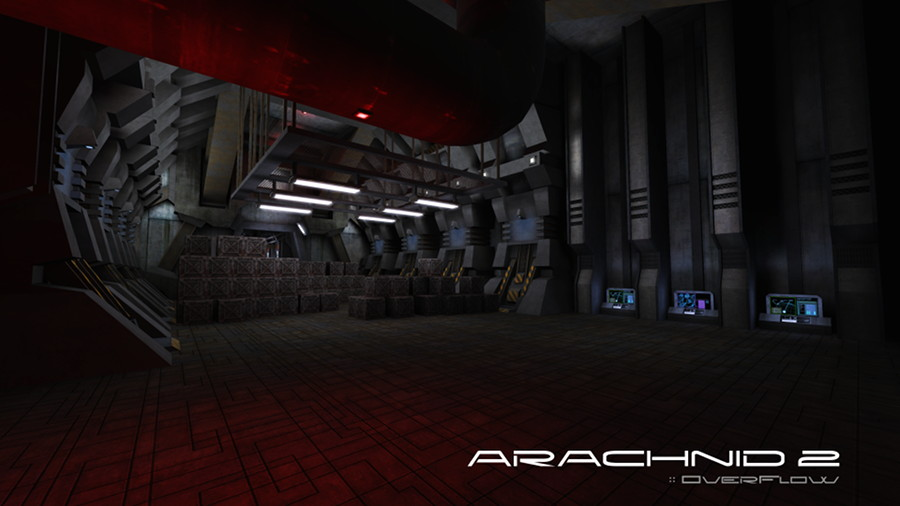

Arachnid 2
----------

This is a map ported from the [Tremulous](http://tremulous.net/) game to the [Unvanquished](https://www.unvanquished.net/) game.

Ported from Tremulous gpp package from [http://ingar.satgnu.net/files/tremulous/base/](http://ingar.satgnu.net/files/tremulous/base/).

This port is an Interstellar Oasis initiative: [https://github.com/interstellar-oasis/interstellar-oasis](https://github.com/interstellar-oasis/interstellar-oasis).

Levelshot
---------



How-to
------

* Get the source

```
git clone https://github.com/interstellar-oasis/map-arachnid2.git map-arachnid2_source.pk3dir
cd map-arachnid2_source.pk3dir/
```

* Build

You need the [grtoolbox](https://github.com/illwieckz/grtoolbox).  
You will find the pk3dir in `build/test`.

```
make
```

* Package

You will find the pk3 in `build/pkg`.

```
make pk3
```

Run the map:

```
daemon -pakpath /where/you/installed/unvanquished/pkg -pakpath build/pkg +devmap arachnid2
```

Credits
-------

Unvanquished port:

* Thomas “illwieckz” Debesse <dev@illwieckz.net> (http://gg.illwieckz.net)

Mapping:

* Robin “OverFlow” Marshall (http://bobbin.vilkacis.net)

Textures & Shaders:

* Robin “OverFlow” Marshall
* Yves “evil lair” Allaire (http://evillair.net)

Special thanks:

* Stijn “Ingar“ Buys <ingar@osirion.org>

Legal
-----

Changes by Thomas Debesse fall under the Internet Systems Consortium License:  
http://directory.fsf.org/wiki/License:ISC

Assets by Tremulous contributors fall under the Creative Commons Attribution-ShareAlike 2.5 Generic License:  
http://creativecommons.org/licenses/by-sa/2.5/

Textures by Yves Allaire fall under the Creative Commons Attribution-ShareAlike 4.0 International License:  
http://creativecommons.org/licenses/by-sa/4.0/

History
-------

* 2009-12-04:	Tremulous 1.2 Beta (Gameplay preview)
* 2006-03-31:	Tremulous 1.1.0 (Standalone)
